# 2021 [MiniHabits](./miniHabit.md)

## **One-Dimensional-Kalman-Filter**

### **Tracking with Gaussian Probabilities**

Replace histograms with Gaussians:

$$\begin{array}{l|l|c}
\text{discrete Bayes} & \text{Gaussian} & \text{Step}\\
\hline
\bar {\mathbf x} = \mathbf x \ast f(\mathbf x) & 
\bar {x}_\mathcal{N} =  x_\mathcal{N} \, \oplus \, f_{x_\mathcal{N}}(\bullet) &
\text{Predict} \\
\mathbf x = \|\mathcal L \bar{\mathbf x}\| & x_\mathcal{N} = L \, \otimes \, \bar{x}_\mathcal{N} & \text{Update} 
\end{array}$$

where $\oplus$ and $\otimes$ is meant to express some unknown operator on Gaussians. I won't do it in the rest of the book, but the subscript indicates that $x_\mathcal{N}$ is a Gaussian. 

The discrete Bayes filter used convolution for the prediction. We showed that it used the *total probabability theorem*, computed as a sum, so maybe we can add the Gaussians. It used multiplications to incorporate the measurement into the prior, so maybe we can multiply the Gaussians. Could it be this easy:

$$\begin{aligned} 
\bar x &\stackrel{?}{=} x + f_x(\bullet) \\
x &\stackrel{?}{=} \mathcal L \cdot \bar x
\end{aligned}$$

This will only work if the sum and product of two Gaussians is another Gaussian. Otherwise after the first epoch $x$ would not be Gaussian, and this scheme falls apart.

### **Predictions with Gaussians**

We use Newton's equation of motion to compute current position based on the current velocity and previous position:

$$ \begin{aligned}\bar{x}_k &= x_{k-1} + v_k \Delta t \\
 &= x_{k-1} + f_x\end{aligned}$$

I've dropped the notation $f_x(\bullet)$ in favor of $f_x$ to keep the equations uncluttered.

If the dog is at 10 m, his velocity is 15 m/s, and the epoch is 2 seconds long, we have

$$ \begin{aligned} f_x &= v\Delta t = 15\cdot 2\\
\bar{x}_k &= 10 + (15\cdot 2) = 40 \end{aligned}$$

We are uncertain about his current position and velocity, so this will not do. We need to express the uncertainty with a Gaussian.

Position is easy. We define $x$ as a Gaussian. If we think the dog is at 10 m, and the standard deviation of our uncertainty is 0.2 m, we get $x=\mathcal N(10, 0.2^2)$.

What about our uncertainty in his movement? We define $f_x$ as a Gaussian. If the dog's velocity is 15 m/s, the epoch is 1 second, and the standard deviation of our uncertainty is 0.7 m/s, we get $f_x = \mathcal N (15, 0.7^2)$.

The equation for the prior is

$$\bar x = x + f_x$$

What is the sum of two Gaussians? In the last chapter I proved that:

$$\begin{gathered}
\mu = \mu_1 + \mu_2 \\
\sigma^2 = \sigma^2_1 + \sigma^2_2
\end{gathered}$$

This is fantastic news; the sum of two Gaussians is another Gaussian!

The math works, but does this make intuitive sense?  Think of the physical representation of this abstract equation. We have

$$\begin{gathered}
x=\mathcal N(10, 0.2^2)\\
f_x = \mathcal N (15, 0.7^2)
\end{gathered}$$

If we add these we get:

$$\begin{aligned}\bar x &= \mu_x + \mu_{f_x} = 10 + 15 &&= 25 \\
\bar\sigma^2 &= \sigma_x^2 + \sigma_{f_x}^2 = 0.2^2 + 0.7^2 &&= 0.53\end{aligned}$$

It makes sense that the predicted position is the previous position plus the movement. What about the variance? It is harder to form an intuition about this. However, recall that with the `predict()` function for the discrete Bayes filter we always lost information. We don't really know where the dog is moving, so the confidence should get smaller (variance gets larger). $\mu_{f_x}^2$ is the amount of uncertainty added to the system due to the imperfect prediction about the movement, and so we would add that to the existing uncertainty.

Let's take advantage of the `namedtuple` class in Python's `collection` module to implement a Gaussian object. We could implement a Gaussian using a tuple, where $\mathcal N(10, 0.04)$ is implemented in Python as `g = (10., 0.04)`. We would access the mean with `g[0]` and the variance with `g[1]`.

`namedtuple` works the same as a tuple, except you provide it with a type name and field names. It's not important to understand, but I modified the `__repr__` method to display its value using the notation in this chapter.

### **Updates with Gaussians**

The discrete Bayes filter encodes our belief about the position of our dog in a histogram of probabilities. The distribution is discrete and multimodal. It can express strong belief that the dog is in two positions at once, and the positions are discrete.

We are proposing that we replace the histogram with a Gaussian. The discrete Bayes filter used this code to compute the posterior:

```python
def update(likelihood, prior):
    posterior = likelihood * prior
    return normalize(posterior)
```

which is an implementation of the equation:

$$x = \| \mathcal L\bar x \|$$

We've just shown that we can represent the prior with a Gaussian. What about the likelihood? The likelihood is the probability of the measurement given the current state. We've learned how to represent measurements as Gaussians. For example, maybe our sensor states that the dog is at 23 m, with a standard deviation of 0.4 meters. Our measurement, expressed as a likelihood, is $z = \mathcal N (23, 0.16)$.

Both the likelihood and prior are modeled with Gaussians. Can we multiply Gaussians? Is the product of two Gaussians another Gaussian?

Yes to the former, and almost to the latter! In the last chapter I proved that the product of two Gaussians is proportional to another Gausian.

$$\begin{aligned}
\mu &= \frac{\sigma_1^2 \mu_2 + \sigma_2^2 \mu_1} {\sigma_1^2 + \sigma_2^2}, \\
\sigma^2 &= \frac{\sigma_1^2\sigma_2^2}{\sigma_1^2+\sigma_2^2}
\end{aligned}$$

We can immediately infer several things. If we normalize the result, the product is another Gaussian. If one Gaussian is the likelihood, and the second is the prior, then the mean is a scaled sum of the prior and the measurement. The variance is a combination of the variances of the prior and measurement. Finally, the variances are completely unaffected by the values of the mean!

We put this in Bayesian terms like so:

$$\begin{aligned}
\mathcal N(\mu, \sigma^2) &= \| prior \cdot likelihood \|\\
&= \| \mathcal{N}(\bar\mu, \bar\sigma^2)\cdot \mathcal{N}(\mu_z, \sigma_z^2) \|\\
&= \mathcal N(\frac{\bar\sigma^2 \mu_z + \sigma_z^2 \bar\mu}{\bar\sigma^2 + \sigma_z^2},\frac{\bar\sigma^2\sigma_z^2}{\bar\sigma^2 + \sigma_z^2})
\end{aligned}$$

examples:
 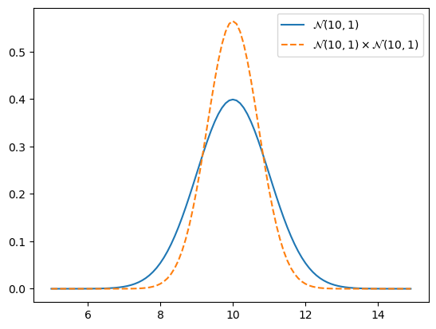
 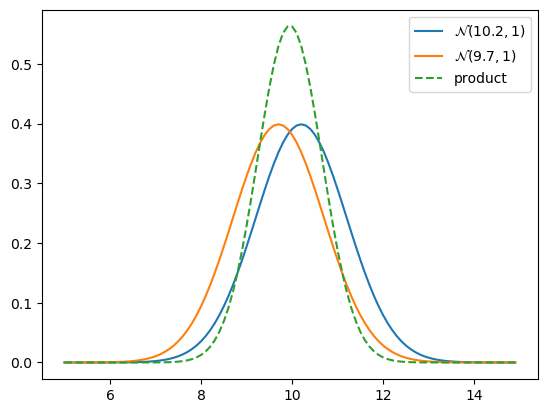

### **Kalman Gain**

We see that the filter works. Now let's go back to the math to understand what is happening. The posterior $x$ is computed as the likelihood times the prior ($\mathcal L \bar x$), where both are Gaussians.

Therefore the mean of the posterior is given by:

$$
\mu=\frac{\bar\sigma^2\, \mu_z + \sigma_z^2 \, \bar\mu} {\bar\sigma^2 + \sigma_z^2}
$$

I use the subscript $z$ to denote the measurement. We can rewrite this as:

$$\mu = \left( \frac{\bar\sigma^2}{\bar\sigma^2 + \sigma_z^2}\right) \mu_z + \left(\frac{\sigma_z^2}{\bar\sigma^2 + \sigma_z^2}\right)\bar\mu$$

In this form it is easy to see that we are scaling the measurement and the prior by weights:

$$\mu = W_1 \mu_z + W_2 \bar\mu$$

The weights sum to one because the denominator is a normalization term. We introduce a new term, $K=W_1$, giving us:

$$\begin{aligned}
\mu &= K \mu_z + (1-K) \bar\mu\\
&= \bar\mu + K(\mu_z - \bar\mu)
\end{aligned}$$

where

$$K = \frac {\bar\sigma^2}{\bar\sigma^2 + \sigma_z^2}$$

$K$ is the *Kalman gain*. It's the crux of the Kalman filter. It is a scaling term that chooses a value partway between $\mu_z$ and $\bar\mu$.

Let's work a few examples. If the measurement is nine times more accurate than the prior, then $\bar\sigma^2 = 9\sigma_z^2$, and

$$\begin{aligned}
\mu&=\frac{9 \sigma_z^2 \mu_z + \sigma_z^2\, \bar\mu} {9 \sigma_z^2 + \sigma_\mathtt{z}^2} \\
&= \left(\frac{9}{10}\right) \mu_z + \left(\frac{1}{10}\right) \bar\mu
\end{aligned}
$$

Hence $K = \frac 9 {10}$, and to form the posterior we take nine tenths of the measurement and one tenth of the prior. 

If the measurement and prior are equally accurate, then $\bar\sigma^2 = \sigma_z^2$ and

$$\begin{gathered}
\mu=\frac{\sigma_z^2\,  (\bar\mu + \mu_z)}{2\sigma_\mathtt{z}^2} \\
= \left(\frac{1}{2}\right)\bar\mu + \left(\frac{1}{2}\right)\mu_z
\end{gathered}$$

which is the average of the two means. It makes intuitive sense to take the average of two equally accurate values.

We can also express the variance in terms of the Kalman gain:

$$\begin{aligned}
\sigma^2 &= \frac{\bar\sigma^2 \sigma_z^2 } {\bar\sigma^2 + \sigma_z^2} \\
&= K\sigma_z^2 \\
&= (1-K)\bar\sigma^2
\end{aligned}$$

We can understand this by looking at this chart:
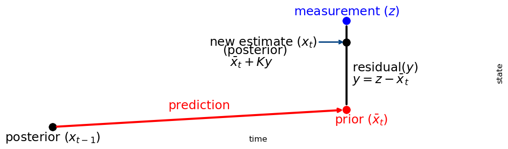

The Kalman gain $K$ is a scale factor that chooses a value along the residual. This leads to an alternative but equivalent implementation for `update()` and `predict()`:

```Python
def update(prior, measurement):
    x, P = prior        # mean and variance of prior
    z, R = measurement  # mean and variance of measurement
    
    y = z - x        # residual
    K = P / (P + R)  # Kalman gain

    x = x + K*y      # posterior
    P = (1 - K) * P  # posterior variance
    return gaussian(x, P)

def predict(posterior, movement):
    x, P = posterior # mean and variance of posterior
    dx, Q = movement # mean and variance of movement
    x = x + dx
    P = P + Q
    return gaussian(x, P)
```

Why have I written it in this form, and why have I chosen these terrible variable names? A few related reasons. A majority of books and papers present the Kalman filter in this form. My derivation of the filter from Bayesian principles is not unknown, but it is not used nearly as often. Alternative derivations naturally lead to this form of the equations. Also, the equations for the multivariate Kalman filter look almost exactly like these equations. So, you need to learn and understand them.

Where do the names `z`, `P`, `Q`, and `R` come from? You will see them used in the rest of this book. In the literature $R$ is nearly universally used for the measurement noise, $Q$ for the process noise and $P$ for the variance of the state. Using $z$ for the measurement is common, albeit not universal. Almost every book and paper you read will use these variable names. Get used to them.

This is also a powerful way to think about filtering. This is the way we reasoned about the g-h filter. It emphasizes taking the residual $y = \mu_z - \bar\mu$, finding the Kalman gain as a ratio of our uncertainty in the prior and measurement $K = P/(P+R)$, and computing the posterior by adding $Ky$ to the prior.

The Bayesian aspect is obscured in this form, as is the fact that we are multiplying the likelihood by the prior. Both viewpoints are equivalent because the math is identical. I chose the Bayesian approach because I think it give a much more intuitive yet deep understanding of the probabilistic reasoning. This alternative form using $K$ gives a deep understanding of what is known as the *orthogonal projection* approach. Dr. Kalman used that derivation, not Bayesian reasoning, when he invented this filter. You will understand more about this in the next few chapters.

We've been doing the same thing in this chapter. The Kalman filter makes a prediction, takes a measurement, and then forms a new estimate somewhere between the two.

**This is extremely important to understand**: Every filter in this book implements the same algorithm, just with different mathematical details. The math can become challenging in later chapters, but the idea is easy to understand.

It is important to see past the details of the equations of a specific filter and understand *what* the equations are calculating and *why*. There are a tremendous number of filters. They all use different math to implement the same algorithm. The choice of math affects the quality of results and what problems can be represented, but not the underlying ideas.

Here is the generic algorithm:

> **Initialization**
>
> 1. Initialize the state of the filter
> 2. Initialize our belief in the state
>
> **Predict**
>
> 1. Use system behavior to predict state at the next time step
> 2. Adjust belief to account for the uncertainty in prediction
>
> **Update**
>
> 1. Get a measurement and associated belief about its accuracy
> 2. Compute residual between estimated state and measurement
> 3. Compute scaling factor based on whether the measurement or prediction is more accurate
> 4. set state between the prediction and measurement based on scaling factor
> 5. update belief in the state based on how certain we are in the measurement

You will be hard pressed to find a Bayesian filter algorithm that does not fit into this form. Some filters will not include some aspects, such as error in the prediction, and others will have very complicated methods of computation, but this is what they all do.

The equations for the univariate Kalman filter are:

**Predict**

$\begin{array}{|l|l|l|}
\hline
\text{Equation} & \text{Implementation} & \text{Kalman Form}\\
\hline
 \bar x = x + f_x & \bar\mu = \mu + \mu_{f_x} & \bar x = x + dx\\
& \bar\sigma^2 = \sigma^2 + \sigma_{f_x}^2 & \bar P = P + Q\\
\hline
\end{array}$

**Update**

$\begin{array}{|l|l|l|}
\hline
\text{Equation} & \text{Implementation}& \text{Kalman Form}\\
\hline
 x = \| \mathcal L\bar x\| & y = z - \bar\mu & y = z - \bar x\\
 & K = \frac {\bar\sigma^2} {\bar\sigma^2 + \sigma_z^2} & K = \frac {\bar P}{\bar P+R}\\
 & \mu = \bar \mu + Ky & x = \bar x + Ky\\
 & \sigma^2 = \frac {\bar\sigma^2 \sigma_z^2} {\bar\sigma^2 + \sigma_z^2} & P = (1-K)\bar P\\
\hline
\end{array}$

## **Multivariate Guassian**

### **Multiplying Multidimensional Gaussians**

In the previous chapter we incorporated an uncertain measurement with an uncertain estimate by multiplying their Gaussians together. The result was another Gaussian with a smaller variance. If two pieces of uncertain information corroborate each other we should be more certain in our conclusion. The graphs look like this:
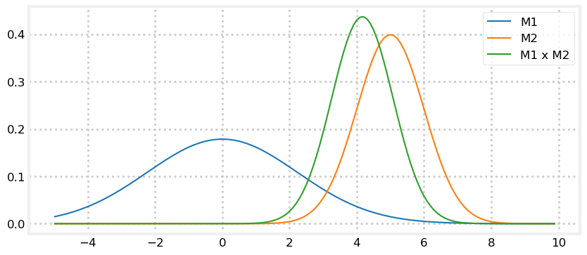
The combination of measurements 1 and 2 yields more certainty, so the new Gaussian is taller and narrower - the variance became smaller. The same happens in multiple dimensions with multivariate Gaussians.

Here are the equations for multiplying multivariate Gaussians. The capital sigma ($\Sigma$) indicates that these are matrices, not scalars. Specifically, they are covariance matrices:

$$\begin{aligned}
\mu &= \Sigma_2(\Sigma_1 + \Sigma_2)^{-1}\mu_1 + \Sigma_1(\Sigma_1 + \Sigma_2)^{-1}\mu_2 \\
\Sigma &= \Sigma_1(\Sigma_1+\Sigma_2)^{-1}\Sigma_2
\end{aligned}$$

They are generated by plugging the multivariate Gaussians for the prior and the estimate into Bayes Theorem. I gave you the algebra for the univariate case in the  **Gaussians** chapter.

You will not need to remember these equations as they are computed by Kalman filter equations that will be presented shortly. This computation is also available in FilterPy using the `multivariate_multiply()` method, which you can import from `filterpy.stats`.

To give you some intuition about this, recall the equations for multiplying univariate Gaussians:

$$\begin{aligned}
\mu &=\frac{\sigma_1^2 \mu_2 + \sigma_2^2 \mu_1} {\sigma_1^2 + \sigma_2^2}, \\
\sigma^2 &= \frac{\sigma_1^2\sigma_2^2}{\sigma_1^2+\sigma_2^2}
\end{aligned}$$

This looks similar to the equations for the multivariate equations. This will be more obvious if you recognize that matrix inversion, denoted by the -1 power, is *like* a reciprocal since $AA^{-1} =I$. I will rewrite the inversions as divisions - this is not a mathematically correct thing to do as division for matrices is not defined, but it does help us compare the equations.

$$\begin{aligned}
\mu &\approx \frac{\Sigma_2\mu_1 + \Sigma_1\mu_2}{\Sigma_1 + \Sigma_2} \\ \\
\Sigma &\approx \frac{\Sigma_1\Sigma_2}{(\Sigma_1+\Sigma_2)}
\end{aligned}$$

In this form the relationship between the univariate and multivariate equations is clear.

Now let's explore multivariate Gaussians in terms of a concrete example. Suppose that we are tracking an aircraft with two radar systems. I will ignore altitude so I can use two dimensional plots. Radar provides the range and bearing to a target. We start out being uncertain about the position of the aircraft, so the covariance, which is our uncertainty about the position, might look like this. In the language of Bayesian statistics this is our *prior*.
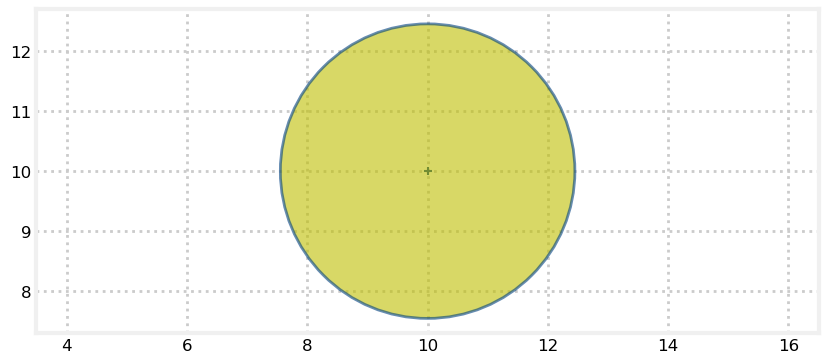

Now suppose that there is a radar to the lower left of the aircraft. Further suppose that the radar's bearing measurement is accurate, but the range measurement is inaccurate. The covariance for the error in the measurement might look like this (plotted in green on top of the yellow prior):
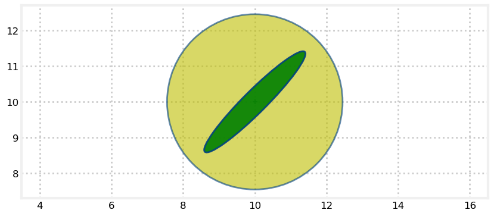

Recall that Bayesian statistics calls this the evidence. The ellipse points towards the radar. It is very long because the range measurement is inaccurate, and the aircraft could be within a considerable distance of the measured range. It is very narrow because the bearing estimate is very accurate and thus the aircraft must be very close to the bearing estimate.

We want to find the posterior - the mean and covariance that results from incorporating the evidence into the prior. As in every other chapter we combine evidence by multiplying them together.
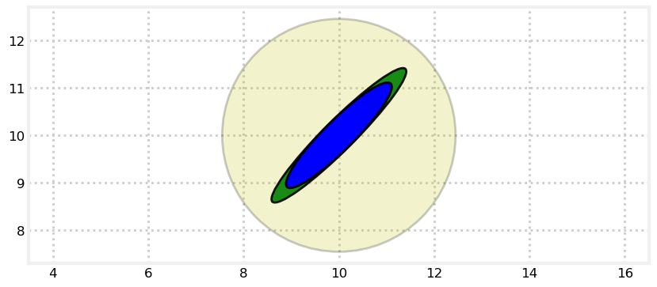

I have plotted the original estimate (prior) in a very transparent yellow, the radar reading in green (evidence), and the finale estimate (posterior) in blue.

The posterior retained the same shape and position as the radar measurement, but is smaller. We've seen this with one dimensional Gaussians. Multiplying two Gaussians makes the variance smaller because we are incorporating more information, hence we are less uncertain. Another point to recognize is that the covariance shape reflects the physical layout of the aircraft and the radar system. The importance of this will become clear in the next step.

Now let's say we get a measurement from a second radar, this one to the lower right. The posterior from the last step becomes our new prior, which I plot in yellow. The new measurement is plotted in green.
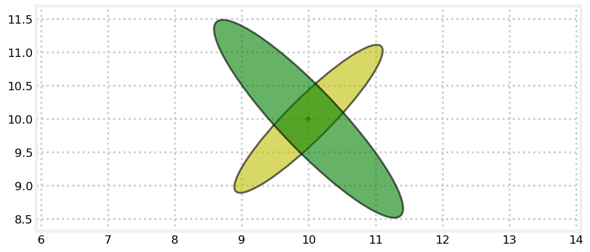

We incorporate this information by multiplying the Gaussians:
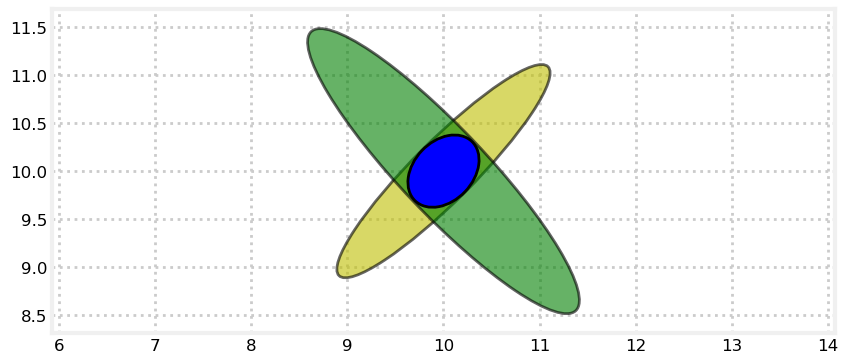

The only likely place for the aircraft is where the two ellipses intersect. The intersection, formed by multiplying the prior and measurement, is a new Gaussian. The shapes reflects the geometry of the problem. This allows us to triangulate on the aircraft, resulting in a very accurate estimate. We didn't explicitly write any code to perform triangulation; it was a natural outcome of multiplying the Gaussians of each measurement together.

For a final example, imagine taking two measurements from the same radar a short time apart. The covariance ellipses will nearly overlap, leaving a very large error in our new estimate:
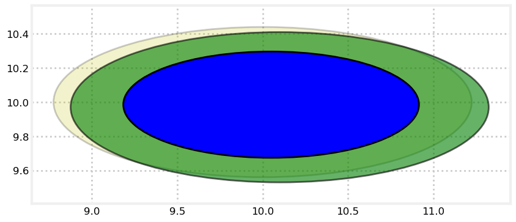

Theory states that roughly 99% of a distribution will fall withing 3 standard deviations, and this appears to be the case.

## **Multivariate Kalman Filters**

The univariate Kalman filter represented the state with a univariate Gaussian. Naturally the multivariate Kalman filter will use a multivariate Gaussian for the state. We learned in the last chapter that multivariate Gaussians use a vector for the mean and a matrix for the covariances. That means that the Kalman filter needs to use linear algebra to perform the estimations.

I don't want you to memorize these equations, but I have listed the univariate and multivariate equations below. They are quite similar.

**Predict**

$\begin{array}{|l|l|l|}
\hline
\text{Univariate} & \text{Univariate} & \text{Multivariate}\\
& \text{(Kalman form)} & \\
\hline
\bar \mu = \mu + \mu_{f_x} & \bar x = x + dx & \bar{\mathbf x} = \mathbf{Fx} + \mathbf{Bu}\\
\bar\sigma^2 = \sigma_x^2 + \sigma_{f_x}^2 & \bar P = P + Q & \bar{\mathbf P} = \mathbf{FPF}^\mathsf T + \mathbf Q \\
\hline
\end{array}$

Without worrying about the specifics of the linear algebra, we can see that:

$\mathbf x,\, \mathbf P$ are the state mean and covariance. They correspond to $x$ and $\sigma^2$.

$\mathbf F$ is the *state transition function*. When multiplied by $\bf x$ it computes the prior.

$\mathbf Q$ is the process covariance. It corresponds to $\sigma^2_{f_x}$.

$\mathbf B$ and $\mathbf u$ are new to us. They let us model control inputs to the system.

**Update**

$\begin{array}{|l|l|l|}
\hline
\text{Univariate} & \text{Univariate} & \text{Multivariate}\\
& \text{(Kalman form)} & \\
\hline
& y = z - \bar x & \mathbf y = \mathbf z - \mathbf{H\bar x} \\
& K = \frac{\bar P}{\bar P+R}&
\mathbf K = \mathbf{\bar{P}H}^\mathsf T (\mathbf{H\bar{P}H}^\mathsf T + \mathbf R)^{-1} \\
\mu=\frac{\bar\sigma^2\, \mu_z + \sigma_z^2 \, \bar\mu} {\bar\sigma^2 + \sigma_z^2} & x = \bar x + Ky & \mathbf x = \bar{\mathbf x} + \mathbf{Ky} \\
\sigma^2 = \frac{\sigma_1^2\sigma_2^2}{\sigma_1^2+\sigma_2^2} & P = (1-K)\bar P &
\mathbf P = (\mathbf I - \mathbf{KH})\mathbf{\bar{P}} \\
\hline
\end{array}$

$\mathbf H$ is the measurement function. We haven't seen this yet in this book and I'll explain it later. If you mentally remove $\mathbf H$ from the equations, you should be able to see these equations are similar as well.

$\mathbf z,\, \mathbf R$ are the measurement mean and noise covariance. They correspond to $z$ and $\sigma_z^2$ in the univariate filter (I've substituted $\mu$ with $x$ for the univariate equations to make the notation as similar as possible).

$\mathbf y$ and $\mathbf K$ are the residual and Kalman gain.

The details will be different than the univariate filter because these are vectors and matrices, but the concepts are exactly the same:

+ Use a Gaussian to represent our estimate of the state and error
+ Use a Gaussian to represent the measurement and its error
+ Use a Gaussian to represent the process model
+ Use the process model to predict the next state (the prior)
+ Form an estimate part way between the measurement and the prior

Your job as a designer will be to design the state $\left(\mathbf x, \mathbf P\right)$, the process $\left(\mathbf F, \mathbf Q\right)$, the measurement $\left(\mathbf z, \mathbf R\right)$, and the  measurement function $\mathbf H$. If the system has control inputs, such as a robot, you will also design $\mathbf B$ and $\mathbf u$.

### **Prediction Equations**

The Kalman filter uses these equations to compute the *prior* - the predicted next state of the system. They compute the prior mean ($\bar{\mathbf x}$)  and covariance ($\bar{\mathbf P}$) of the system.

$$\begin{aligned}
\mathbf{\bar x} &= \mathbf{Fx} + \mathbf{Bu}\\
\mathbf{\bar P} &= \mathbf{FPF}^\mathsf T + \mathbf Q
\end{aligned}$$

$\underline{\textbf{Mean}}$

$\mathbf{\bar x} = \mathbf{Fx} + \mathbf{Bu}$

As a reminder, the linear equation $\mathbf{Ax} = \mathbf b$ represents a system of equations, where $\mathbf A$ holds the coefficients set of equations, $\mathbf x$ is the vector of variables. Performing the multiplication $\mathbf{Ax}$ computes the right hand side values for that set of equations, represented by $\mathbf b$.

If $\mathbf F$ contains the state transition for a given time step, then the product $\mathbf{Fx}$ computes the state after that transition. Easy! Likewise, $\mathbf B$ is the control function, $\mathbf u$ is the control input, so $\mathbf{Bu}$ computes the contribution of the controls to the state after the transition. Thus, the prior $\mathbf{\bar x}$ is computed as the sum of $\mathbf{Fx}$ and $\mathbf{Bu}$.

The equivalent univariate equation is

$$\bar\mu = \mu + \mu_{move}$$

If you perform the matrix multiplication $\mathbf{Fx}$ it generates this equation for $x$.

Let's make this explicit. Recall the value for $\mathbf F$ from the last chapter:

$$\mathbf F = \begin{bmatrix}1&\Delta t  \\ 0&1\end{bmatrix}$$

Thus $\mathbf{\bar x} = \mathbf{Fx}$ corresponds to the set of linear equations:

$$\begin{cases}
\begin{aligned}
\bar x &= 1x + &\Delta t\, \dot x \\
\bar{\dot x} &=0x + &1\, \dot x
\end{aligned}
\end{cases}$$

$\underline{\textbf{Covariance}}$

$\mathbf{\bar P} = \mathbf{FPF}^\mathsf T + \mathbf Q$

This equation is not as easy to understand so we will spend more time on it.

In univariate version of this equation is:

$$\bar\sigma^2 = \sigma^2 + \sigma^2_{move}$$

We add the variance of the movement to the variance of our estimate to reflect the loss of knowlege. We need to do the same thing here, except it isn't quite that easy with multivariate Gaussians.

We can't simply write $\mathbf{\bar P} = \mathbf P + \mathbf Q$. In a multivariate Gaussians the state variables are *correlated*. What does this imply? Our knowledge of the velocity is imperfect, but we are adding it to the position with

$$\bar x = \dot x\Delta t + x$$

Since we do not have perfect knowledge of the value of $\dot x$ the sum $\bar x = \dot x\Delta t + x$ gains uncertainty. Because the positions and velocities are correlated we cannot simply add the covariance matrices. For example, if $\mathbf P$ and $\mathbf Q$ are diagonal matrices the sum would also be diagonal. But we know position is correlated to velocity so the off-diagonal elements should be non-zero.

The correct equation is

$$\mathbf{\bar P} = \mathbf{FPF}^\mathsf T + \mathbf Q$$

Expressions in the form $\mathbf{ABA}^\mathsf T$ are common in linear algebra. You can think of it as *projecting* the middle term by the outer term. We will be using this many times in the rest of the book. I admit this may be a 'magical' equation to you. Let's explore it.

When we initialize $\mathbf P$ with

$$\mathbf P = \begin{bmatrix}\sigma^2_x & 0 \\ 0 & \sigma^2_v\end{bmatrix}$$

the value for $\mathbf{FPF}^\mathsf T$ is:

$$\begin{aligned}
\mathbf{FPF}^\mathsf T &= \begin{bmatrix}1&\Delta t\\0&1\end{bmatrix}
\begin{bmatrix}\sigma^2_x & 0 \\  0 & \sigma^2_{v}\end{bmatrix}
\begin{bmatrix}1&0\\\Delta t&1\end{bmatrix} \\
&= \begin{bmatrix}\sigma^2_x&\sigma_v^2\Delta t\\  0 & \sigma^2_{v}\end{bmatrix}
\begin{bmatrix}1&0\\\Delta t&1\end{bmatrix} \\
&= \begin{bmatrix}\sigma^2_x +  \sigma_v^2\Delta t^2  &  \sigma_v^2\Delta t \\
\sigma_v^2\Delta t & \sigma^2_{v}\end{bmatrix}
\end{aligned}$$

The initial value for $\mathbf P$ had no covariance between the position and velocity.  Position is computed as $\dot x\Delta t + x$, so there is a correlation between the position and velocity. The multiplication $\mathbf{FPF}^\mathsf T$ computes a covariance of $\sigma_v^2 \Delta t$. The exact value is not important; you just need to recognize that $\mathbf{FPF}^\mathsf T$ uses the process model to automatically compute the covariance between the position and velocity!

Another way to think of this is to reflect on the $\mathbf{Fx}$ multiplication. That projected $\mathbf x$ forward in time. $\mathbf {FP}$ might seem to be the equivalent operation, but $\mathbf P$ is a matrix while $\mathbf x$ is a vector. The trailing $\mathbf F^\mathsf T$ term ensures that we multiply by both the rows and columns of $\mathbf F$. In the second line of the computation of $\mathbf{FPF}^\mathsf T$ we have the value for $\mathbf{FP}$. You can see that it is an upper triangular matrix because we haven't fully incorporated $\mathbf F$ into the multiplication.

If you have some experience with linear algebra and statistics, this may help. The covariance due to the prediction can be modeled as the expected value of the error in the prediction step, given by this equation.

$$\begin{aligned}
\bar{\mathbf P} &= \mathbb E[(\mathbf{Fx})(\mathbf{Fx})^\mathsf T]\\
 &= \mathbb E[\mathbf{Fxx}^\mathsf T\mathbf F^\mathsf T] \\
 &= \mathbf F\, \mathbb E[\mathbf{xx}^\mathsf T]\, \mathbf F^\mathsf T
\end{aligned}$$

Of course, $\mathbb E[\mathbf{xx}^\mathsf T]$ is just $\mathbf P$, giving us

$$\bar{\mathbf P} = \mathbf{FPF}^\mathsf T$$

Let's look at its effect. Here I use $\mathbf F$ from our filter and project the state forward 6/10ths of a second. I do this five times so you can see how $\mathbf{\bar P}$ continues to change.
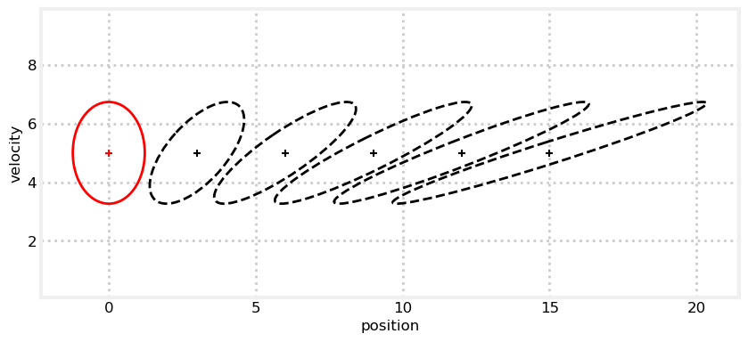

### **Update Equations**

The update equations look messier than the predict equations, but that is mostly due to the Kalman filter computing the update in measurement space. This is because measurements are not *invertible*. For example, consider a  sensor that gives the range to a target. It is impossible to convert a range into a position - an infinite number of positions in a circle will yield the same range. On the other hand, we can always compute the range (measurement) given a position (state).

Before I continue, recall that we are trying to do something very simple: choose a new estimate chosen somewhere between a measurement and a prediction, as in this chart:


The equations will be complicated because the state has multiple dimensions, but this operations is what we are doing. Don't let the equations distract you from the simplicity of this idea.

$\underline{\textbf{System Uncertainty}}$

$\textbf{S} = \mathbf{H\bar PH}^\mathsf T + \mathbf R$

To work in measurement space the Kalman filter has to project the covariance matrix into measurement space. The math for this is $\mathbf{H\bar PH}^\mathsf T$, where $\mathbf{\bar P}$ is the *prior* covariance and $\mathbf H$ is the measurement function.


You should recognize this $\mathbf{ABA}^\mathsf T$ form - the prediction step used $\mathbf{FPF}^\mathsf T$ to update $\mathbf P$ with the state transition function. Here, we use the same form to update it with the measurement function. The linear algebra is changing the coordinate system for us. 

Once the covariance is in measurement space we need to account for the sensor noise. This is very easy  - we just add matrices. The result is variously called the *system uncertainty* or *innovation covariance*.

If you ignore the $\mathbf H$ term this equation is the equivalent to the denominator in the univariate equation for the Kalman gain:

$$K = \frac {\bar\sigma^2} {\bar\sigma^2 + \sigma_z^2}$$

Compare the equations for the system uncertainty and the covariance

$$\begin{aligned}
\mathbf{S} &= \mathbf{H\bar PH}^\mathsf T + \mathbf R\\
\mathbf{\bar P} &= \mathbf{FPF}^\mathsf T + \mathbf Q
\end{aligned}$$

In each equation $\mathbf P$ is put into a different space with either the function $\mathbf H$ or $\mathbf F$. Then we add the noise matrix associated with that space.

$\underline{\textbf{Kalman Gain}}$

$\mathbf K = \mathbf{\bar PH}^\mathsf T \mathbf{S}^{-1}$

Look back at the residual diagram. Once we have a prediction and a measurement we need to select an estimate somewhere between the two. If we have more certainty about the measurement the estimate will be closer to it. If instead we have more certainty about the prediction then the estimate will be closer to it. 

In the univariate chapter we scaled the mean using this equation

$$
\mu =\frac{\bar\sigma^2 \mu_z + \sigma_\mathtt{z}^2 \bar\mu} {\bar\sigma^2 + \sigma_\mathtt{z}^2}$$

which we simplified to

$$\mu = (1-K)\bar\mu + K\mu_\mathtt{z}$$

which gave us

$$K = \frac {\bar\sigma^2} {\bar\sigma^2 + \sigma_z^2}$$

$K$ is the *Kalman gain*, and it is a real number between 0 and 1. Ensure you understand how it selects a mean somewhere between the prediction and measurement. The Kalman gain is a *percentage* or *ratio* - if K is .9 it takes 90% of the measurement and 10% of the prediction. 

For the multivariate Kalman filter $\mathbf K$ is a vector, not a scalar. Here is the equation again: $\mathbf K = \mathbf{\bar PH}^\mathsf T \mathbf{S}^{-1}$. Is this a *ratio*? We can think of the inverse of a matrix as linear algebra's way of finding the reciprocal. Division is not defined for matrices, but it is useful to think of it in this way. So we can read the equation for $\textbf{K}$ as meaning

$$\begin{aligned} \mathbf K &\approx \frac{\mathbf{\bar P}\mathbf H^\mathsf T}{\mathbf{S}} \\
\mathbf K &\approx \frac{\mathsf{uncertainty}_\mathsf{prediction}}{\mathsf{uncertainty}_\mathsf{measurement}}\mathbf H^\mathsf T
\end{aligned}$$

The Kalman gain equation computes a ratio based on how much we trust the prediction vs the measurement. We did the same thing in every prior chapter. The equation is complicated because we are doing this in multiple dimensions via matrices, but the concept is simple. The $\mathbf H^\mathsf T$ term is less clear, I'll explain it soon. If you ignore that term the equation for the Kalman gain is the same as the univariate case: divide the uncertainty of the prior with the of the sum of the uncertainty of the prior and measurement.

$\underline{\textbf{Residual}}$

$\mathbf y = \mathbf z - \mathbf{H\bar{x}}$

This is an easy one as we've covered this equation while designing the measurement function $\mathbf H$. Recall that the measurement function converts a state into a measurement. So $\mathbf{Hx}$ converts $\mathbf x$ into an equivalent measurement. Once that is done, we can subtract it from the measurement $\mathbf z$ to get the residual - the difference between the measurement and prediction.

The univariate equation is

$$y = z - \bar x$$

and clearly computes the same thing, but only in one dimension.

$\underline{\textbf{State Update}}$

$\mathbf x = \mathbf{\bar x} + \mathbf{Ky}$

We select our new state to be along the residual, scaled by the Kalman gain. The scaling is performed by $\mathbf{Ky}$, which both scales the residual and converts it back into state space with the $\mathbf H^\mathsf T$ term which is in $\mathbf K$. This is added to the prior, yielding the equation: $\mathbf x =\mathbf{\bar x} + \mathbf{Ky}$. Let me write out $\mathbf K$ so we can see the entire computation:

$$\begin{aligned}
\mathbf x &= \mathbf{\bar x} + \mathbf{Ky} \\
&= \mathbf{\bar x} + \mathbf{\bar PH}^\mathsf T \mathbf{S}^{-1}\mathbf y \\
&\approx \mathbf{\bar x} + \frac{\mathsf{uncertainty}_\mathsf{prediction}}{\mathsf{uncertainty}_\mathsf{measurement}}\mathbf H^\mathsf T\mathbf y
\end{aligned}$$

Perhaps a better way to *see* the ratio is to rewrite the estimate equation:

$$\begin{aligned}
\mathbf x &= \mathbf{\bar x} + \mathbf{Ky} \\
&= \mathbf{\bar x} +\mathbf K(\mathbf z - \mathbf{H\bar x}) \\
&= (\mathbf I - \mathbf{KH})\mathbf{\bar x} + \mathbf{Kz}
\end{aligned}$$

The similarity between this and the univariate form should be obvious:
$$\mu = (1-K)\bar\mu + K\mu_\mathtt{z}$$

$\underline{\textbf{Covariance Update}}$

$\mathbf P = (\mathbf{I}-\mathbf{KH})\mathbf{\bar P}$

$\mathbf{I}$ is the identity matrix, and is the way we represent $1$ in multiple dimensions. $\mathbf H$ is our measurement function, and is a constant.  We can think of the equation as $\mathbf P = (1-c\mathbf K)\mathbf P$. $\mathbf K$ is our ratio of how much prediction vs measurement we use. If $\mathbf K$ is large then $(1-\mathbf{cK})$ is small, and $\mathbf P$ will be made smaller than it was. If $\mathbf K$ is small, then $(1-\mathbf{cK})$ is large, and $\mathbf P$ will be relatively larger. This means that we adjust the size of our uncertainty by some factor of the Kalman gain.

This equation can be numerically unstable and I don't use it in FilterPy. The subtraction can destroy symmetry and lead to floating point errors over time. Later I'll share more complicated but numerically stable forms of this equation.

### **Summary**

We have learned the Kalman filter equations. Here they are all together for your review. There was a lot to learn, but I hope that as you went through each you recognized it's kinship with the equations in the univariate filter. In the *Kalman Math* chapter I will show you that if we set the dimension of $\mathbf x$ to one that these equations revert back to the equations for the univariate filter. This is not "like" the univariate filter - it is a multidimensional implementation of it.

$$
\begin{aligned}
\text{Predict Step}\\
\mathbf{\bar x} &= \mathbf{F x} + \mathbf{B u} \\
\mathbf{\bar P} &= \mathbf{FP{F}}^\mathsf T + \mathbf Q \\
\\
\text{Update Step}\\
\textbf{S} &= \mathbf{H\bar PH}^\mathsf T + \mathbf R \\
\mathbf K &= \mathbf{\bar PH}^\mathsf T \mathbf{S}^{-1} \\
\textbf{y} &= \mathbf z - \mathbf{H \bar x} \\
\mathbf x &=\mathbf{\bar x} +\mathbf{K\textbf{y}} \\
\mathbf P &= (\mathbf{I}-\mathbf{KH})\mathbf{\bar P}
\end{aligned}
$$

I want to share a form of the equations that you will see in the literature. There are many different notation systems used, but this gives you an idea of what to expect.

 $$
\begin{aligned}
\hat{\mathbf x}_{k\mid k-1} &= \mathbf F_k\hat{\mathbf x}_{k-1\mid k-1} + \mathbf B_k \mathbf u_k  \\
\mathbf P_{k\mid k-1} &=  \mathbf F_k \mathbf P_{k-1\mid k-1} \mathbf F_k^\mathsf T + \mathbf Q_k \\ 
\tilde{\mathbf y}_k &= \mathbf z_k - \mathbf H_k\hat{\mathbf x}_{k\mid k-1}\\
\mathbf{S}_k &= \mathbf H_k \mathbf P_{k\mid k-1} \mathbf H_k^\mathsf T + \mathbf R_k \\
\mathbf K_k &= \mathbf P_{k\mid k-1}\mathbf H_k^\mathsf T \mathbf{S}_k^{-1}\\
\hat{\mathbf x}_{k\mid k} &= \hat{\mathbf x}_{k\mid k-1} + \mathbf K_k\tilde{\mathbf y}_k\\
\mathbf P_{k|k} &= (I - \mathbf K_k \mathbf H_k) \mathbf P_{k|k-1}
\\\end{aligned}
$$

This notation uses the Bayesian $a\mid b$ notation, which means $a$ given the evidence of $b$. The hat means estimate. Thus $\hat{\mathbf x}_{k\mid k}$ means the estimate of the state $\mathbf x$ at step $k$ (the first k) given the evidence from step $k$ (the second k). The posterior, in other words. $\hat{\mathbf x}_{k\mid k-1}$ means the estimate for the state $\mathbf x$ at step $k$ given the estimate from step $k - 1$. The prior, in other words. 

This notation, copied from [Wikipedia](https://en.wikipedia.org/wiki/Kalman_filter#Details) [[1]](#[wiki_article]), allows a mathematician to express himself exactly. In formal publications presenting new results this precision is necessary. As a programmer I find it fairly unreadable. I am used to thinking about variables changing state as a program runs, and do not use a different variable name for each new computation. There is no agreed upon format in the literature, so each author makes different choices. I find it challenging to switch quickly between books and papers, and so have adopted my admittedly less precise notation. Mathematicians may write scathing emails to me, but I hope programmers and students will rejoice at my simplified notation.

The **Symbology** Appendix lists the notation used by various authors. This brings up another difficulty. Different authors use different variable names. $\mathbf x$ is fairly universal, but after that it is anybody's guess. For example, it is common to use $\mathbf{A}$ for what I call $\mathbf F$. You must read carefully, and hope that the author defines their variables (they often do not).

If you are a programmer trying to understand a paper's equations, I suggest starting by removing all of the superscripts, subscripts, and diacriticals, replacing them with a single letter. If you work with equations like this every day this is superfluous advice, but when I read I am usually trying to understand the flow of computation. To me it is far more understandable to remember that $P$ in this step represents the updated value of $P$ computed in the last step, as opposed to trying to remember what $P_{k-1}(+)$ denotes, and what its relation to $P_k(-)$ is, if any, and how any of that relates to the completely different notation used in the paper I read 5 minutes ago.

### **How Velocity is Calculated**

I haven't explained how the filter computes the velocity, or any hidden variable. If we plug in the values we calculated for each of the filter's matrices we can see what happens.

First we need to compute the system uncertainty.

$$\begin{aligned}
\textbf{S} &= \mathbf{H\bar PH}^\mathsf T + \mathbf R \\
&= \begin{bmatrix} 1 & 0\end{bmatrix}
\begin{bmatrix}\sigma^2_x & \sigma_{xv} \\ \sigma_{xv} & \sigma^2_v\end{bmatrix}
\begin{bmatrix} 1 \\ 0\end{bmatrix} + \begin{bmatrix}\sigma_z^2\end{bmatrix}\\
&= \begin{bmatrix}\sigma_x^2 & \sigma_{xv}\end{bmatrix}\begin{bmatrix} 1 \\ 0\end{bmatrix}+ \begin{bmatrix}\sigma_z^2\end{bmatrix} \\
&= \begin{bmatrix}\sigma_x^2 +\sigma_z^2\end{bmatrix}
\end{aligned}$$

Now that we have $\mathbf S$ we can find the value for the Kalman gain:
$$\begin{aligned}
\mathbf K &= \mathbf{\bar PH}^\mathsf T \mathbf{S}^{-1} \\
&= \begin{bmatrix}\sigma^2_x & \sigma_{xv} \\ \sigma_{xv} & \sigma^2_v\end{bmatrix}
\begin{bmatrix} 1 \\ 0\end{bmatrix}
\begin{bmatrix}\frac{1}{\sigma_x^2 +\sigma_z^2}\end{bmatrix} \\
&= \begin{bmatrix}\sigma^2_x  \\ \sigma_{xv}\end{bmatrix}
\begin{bmatrix}\frac{1}{\sigma_x^2 +\sigma_z^2}\end{bmatrix} \\
&= \begin{bmatrix}\sigma^2_x/(\sigma_x^2 +\sigma_z^2)  \\ \sigma_{xv}/(\sigma_x^2 +\sigma_z^2)\end{bmatrix}
\end{aligned}
$$

In other words, the Kalman gain for $x$ is

$$K_x = \frac{VAR(x)}{VAR(x)+VAR(z)}$$

This should be very familiar to you from the univariate case.

The Kalman gain for the velocity $\dot x$ is
$$K_{\dot x} = \frac{COV(x, \dot x)}{VAR(x)+VAR(z)}$$

What is the effect of this? Recall that we compute the state as

$$\begin{aligned}\mathbf x 
&=\mathbf{\bar x}+\mathbf K(z-\mathbf{Hx)} \\
&= \mathbf{\bar x}+\mathbf Ky\end{aligned}$$

Here the residual $y$ is a scalar. Therefore it is multiplied into each element of $\mathbf K$. Therefore we have

$$\begin{bmatrix}x \\ \dot x\end{bmatrix}=\begin{bmatrix}\bar x \\ \bar{\dot x}\end{bmatrix} + \begin{bmatrix}K_x \\ K_{\dot x}\end{bmatrix}y$$

Which gives this system of equations:

$$\begin{aligned}x& = \bar x + yK_x\\
\dot x &= \bar{\dot x} + yK_{\dot x}\end{aligned}$$

The prediction $\bar x$ was computed as $x + \bar x \Delta t$. If the prediction was perfect then the residual will be $y=0$ (ignoring noise in the measurement) and the velocity estimate will be unchanged. On the other hand, if the velocity estimate was very bad then the prediction will be very bad, and the residual will be large: $y >> 0$. In this case we update the velocity estimate with $yK_{\dot x}$. $K_{\dot x}$ is proportional to $COV(x,\dot x)$. Therefore the velocity is updated by the error in the position times the value proportional to the covariance between the position and velocity. The higher the correlation the larger the correction.

To bring this full circle, $COV(x,\dot x)$ are the off-diagonal elements of $\mathbf P$. Recall that those values were computed with $\mathbf{FPF}^\mathsf T$. So the covariance of position and velocity is computed during the predict step. The Kalman gain for the velocity is proportional to this covariance, and we adjust the velocity estimate based on how inaccurate it was during the last epoch times a value proportional to this covariance.

In summary, these linear algebra equations may be unfamiliar to you, but computation is actually very simple. It is essentially the same computation that we performed in the g-h filter. Our constants are different in this chapter because we take the noise in the process model and sensors into account, but the math is the same.

### **Filter Initialization**

There are many schemes for initializing the filter. The following approach performs well in most situations. In this scheme you do not initialize the filter until you get the first measurement, $\mathbf z_0$. From this you can compute the initial value for $\mathbf x$ with $\mathbf x_0 = \mathbf z_0$. If  $\mathbf z$ is not of the same size, type, and units as $\mathbf x$, which is usually the case, we can use our measurement function as follow.

We know

$$\mathbf z = \mathbf{Hx}$$

Hence,

$$\begin{aligned}
\mathbf H^{-1}\mathbf{Hx} &= \mathbf H^{-1}\mathbf z \\
\mathbf x &= \mathbf H^{-1}\mathbf z\end{aligned}$$

Matrix inversion requires a square matrix, but $\mathbf H$ is rarely square. SciPy will compute the Moore-Penrose pseudo-inverse of a matrix with `scipy.linalg.pinv`

Specialized knowledge of your problem domain may lead you to a different computation, but this is one way to do it. For example, if the state includes velocity you might take the first two measurements of position, compute the difference, and use that as the initial velocity.

Now we need to compute a value for $\mathbf P$. This will vary by problem, but in general you will use the measurement error $\mathbf R$ for identical terms, and maximum values for the rest of the terms. Maybe that isn't clear. In this chapter we have been tracking and object using position and velocity as the state, and the measurements have been positions. In that case we would initialize $\mathbf P$ with

$$\mathbf P = \begin{bmatrix}\mathbf R_0 & 0 \\0 & vel_{max}^2\end{bmatrix}$$

The diagonal of $\mathbf P$ contains the variance of each state variable, so we populate it with reasonable values. $\mathbf R$ is a reasonable variance for the position, and the maximum velocity squared is a reasonable variance for the velocity. It is squared because variance is squared: $\sigma^2$.

You really need to understand the domain in which you are working and initialize your filter on the best available information. For example, suppose we were trying to track horses in a horse race. The initial measurements might be very bad, and provide you with a position far from the starting gate. We know that the horse must start at the starting gate; initializing the filter to the initial measurement would lead to suboptimal results. In this scenario we would want to always initialize the Kalman filter with the starting gate position of the horse.

### **Some Advise**

Here we see that the filter initially struggles for several iterations to acquire the track, but then it accurately tracks our dog. In fact, this is nearly optimum - we have not designed $\mathbf Q$ optimally, but $\mathbf R$ is optimal. A rule of thumb for $\mathbf Q$ is to set it between $\frac{1}{2}\Delta a$ to $\Delta a$, where $\Delta a$ is the maximum amount that the acceleration will change between sample periods. This only applies for the assumption we are making in this chapter - that acceleration is constant and uncorrelated between each time period. In the Kalman Math chapter we will discuss several different ways of designing $\mathbf Q$.

To some extent you can get similar looking output by varying either ${\mathbf R}$ or ${\mathbf Q}$, but I urge you to not 'magically' alter these until you get output that you like. Always think about the physical implications of these assignments, and vary ${\mathbf R}$ and/or ${\mathbf Q}$ based on your knowledge of the system you are filtering. Back that up with extensive simulations and/or trial runs of real data.

### Stable Compution of the Posterior Covariance

I've presented the equation to compute the posterior covariance as

$$\mathbf P = (\mathbf I - \mathbf{KH})\mathbf{\bar P}$$

and while strictly speaking this is correct, this is not how I compute it in `FilterPy`, where I use the *Joseph* equation

$$\mathbf P = (\mathbf I-\mathbf {KH})\mathbf{\bar P}(\mathbf I-\mathbf{KH})^\mathsf T + \mathbf{KRK}^\mathsf T$$

I frequently get emails and/or GitHub issues raised, claiming the implementation is a bug. It is not a bug, and I use it for several reasons. First, the subtraction $(\mathbf I - \mathbf{KH})$ can lead to nonsymmetric matrices results due to floating point errors. Covariances must be symmetric, and so becoming nonsymmetric usually leads to the Kalman filter diverging, or even for the code to raise an exception because of the checks built into `NumPy`.

A traditional way to preserve symmetry is the following formula:

$$\mathbf P = (\mathbf P + \mathbf P^\mathsf T) / 2$$

This is safe because $\sigma_{ij} = \sigma_{ji}$ for all covariances in the matrix. Hence this operation averages the error between the differences of the two values if they have diverged due to floating point errors.

If you look at the Joseph form for the equation above, you'll see there is a similar $\mathbf{ABA}^\mathsf T$ pattern in both terms. So they both preserve symmetry. But where did this equation come from, and why do I use it instead of

$$\mathbf P = (\mathbf I - \mathbf{KH})\mathbf{\bar P} \\
\mathbf P = (\mathbf P + \mathbf P^\mathsf T) / 2$$

Let's just derive the equation from first principles. It's not too bad, and you need to understand the derivation to understand the purpose of the equation, and, more importantly, diagnose issues if you filter diverges due to numerical instability. This derivation comes from Brown[4].

First, some symbology. $\mathbf x$ is the true state of our system. $\mathbf{\hat x}$ is the estimated state of our system - the posterior. And $\mathbf{\bar x}$ is the estimated prior of the system.

Given that, we can define our model to be

$$\mathbf x_{k+1} = \mathbf F_k \mathbf x_k + \mathbf w_k \\
\mathbf z_k = \mathbf H_k \mathbf x_k + \mathbf v_k$$

In words, the next state $\mathbf x_{k+1}$ of the system is the current state $k$ moved by some process $\mathbf F_k$ plus some noise $\mathbf w_k$.

Note that these are definitions. No system perfectly follows a mathematical model, so we model that with the noise term $\mathbf w_k$. And no measurement is perfect due to sensor error, so we model that with $\mathbf v_k$

I'll dispense with the subscript $k$ since in the remainder of the derivation we will only consider values at step $k$, never step $k+1$.

Now we define the estimation error as the difference between the true state and the estimated state

$$ \mathbf e = \mathbf x - \mathbf{\hat x}$$

Again, this is a definition; we don't know how to compute $\mathbf e$, it is just the defined difference between the true and estimated state.

This allows us to define the covariance of our estimate, which is defined as the expected value of $\mathbf{ee}^\mathsf T$:

$$\begin{aligned}
P &= E[\mathbf{ee}^\mathsf T] \\
&= E[(\mathbf x - \mathbf{\hat x})(\mathbf x - \mathbf{\hat x})^\mathsf T]
\end{aligned}$$

Next, we define the posterior estimate as

$$\mathbf {\hat x} = \mathbf{\bar x} + \mathbf K(\mathbf z - \mathbf{H \bar x})$$

That looks like the equation from the Kalman filter, and for good reason. But as with the rest of the math so far, this is a **definition**. In particular, we have not defined $\mathbf K$, and you shouldn't think of it as the Kalman gain, because we are solving this for *any* problem, not just for linear Kalman filters. Here, $\mathbf K$ is just some unspecified blending value between 0 and 1.

Now we have our definitions, let's perform some substitution and algebra.

The term $(\mathbf x - \mathbf{\hat x})$ can be expanded by replacing $\mathbf{\hat x}$ with the definition above, yielding

$$(\mathbf x - \mathbf{\hat x}) = \mathbf x - (\mathbf{\bar x} + \mathbf K(\mathbf z - \mathbf{H \bar x}))$$

Now we replace $\mathbf z$ with $\mathbf H \mathbf x + \mathbf v$:

$$\begin{aligned}
(\mathbf x - \mathbf{\hat x})
&= \mathbf x - (\mathbf{\bar x} + \mathbf K(\mathbf z - \mathbf{H \bar x})) \\
&= \mathbf x - (\mathbf{\bar x} + \mathbf K(\mathbf H \mathbf x + \mathbf v - \mathbf{H \bar x})) \\
&= (\mathbf x - \mathbf{\bar x}) - \mathbf K(\mathbf H \mathbf x + \mathbf v - \mathbf{H \bar x}) \\
&= (\mathbf x - \mathbf{\bar x}) - \mathbf{KH}(\mathbf x - \mathbf{ \bar x}) - \mathbf{Kv} \\
&=  (\mathbf I - \mathbf{KH})(\mathbf x - \mathbf{\bar x}) - \mathbf{Kv}
\end{aligned}$$

Now we can solve for $\mathbf P$ if we note that the expected value of $(\mathbf x - \mathbf{\bar x})$ is the prior covariance $\mathbf{\bar P}$, and that the expected value of $\mathbf v$ is $E[\mathbf{vv}^\mathbf T] = \mathbf R$:

$$\begin{aligned}
\mathbf P &= 
   E\big[[(\mathbf I - \mathbf{KH})(\mathbf x - \mathbf{\bar x}) - \mathbf{Kv})]
  [(\mathbf I - \mathbf{KH})(\mathbf x - \mathbf{\bar x}) - \mathbf{Kv}]^\mathsf T\big ] \\
  &= (\mathbf I - \mathbf{KH})\mathbf{\bar P}(\mathbf I - \mathbf{KH})^\mathsf T + \mathbf{KRK}^\mathsf T
\end{aligned}$$

which is what we came here to prove.

Note that this equation is valid for *any* $\mathbf K$, not just the optimal $\mathbf K$ computed by the Kalman filter. And that is why I use this equation. In practice the Kalman gain computed by the filter is *not* the optimal value both because the real world is never truly linear and Gaussian, and because of floating point errors induced by computation. This equation is far less likely to cause the Kalman filter to diverge in the face of real world conditions.

Where did $\mathbf P = (\mathbf I - \mathbf{KH})\mathbf{\bar P}$ come from, then? Let's finish the derivation, which is simple. Recall that the Kalman filter (optimal) gain is given by

$$\mathbf K = \mathbf{\bar P H^\mathsf T}(\mathbf{H \bar P H}^\mathsf T + \mathbf R)^{-1}$$

Now we substitute this into the equation we just derived:

$$\begin{aligned}
&= (\mathbf I - \mathbf{KH})\mathbf{\bar P}(\mathbf I - \mathbf{KH})^\mathsf T + \mathbf{KRK}^\mathsf T\\
&= \mathbf{\bar P} - \mathbf{KH}\mathbf{\bar P} - \mathbf{\bar PH}^\mathsf T\mathbf{K}^\mathsf T + \mathbf K(\mathbf{H \bar P H}^\mathsf T + \mathbf R)\mathbf K^\mathsf T \\
&= \mathbf{\bar P} - \mathbf{KH}\mathbf{\bar P} - \mathbf{\bar PH}^\mathsf T\mathbf{K}^\mathsf T + \mathbf{\bar P H^\mathsf T}(\mathbf{H \bar P H}^\mathsf T + \mathbf R)^{-1}(\mathbf{H \bar P H}^\mathsf T + \mathbf R)\mathbf K^\mathsf T\\
&= \mathbf{\bar P} - \mathbf{KH}\mathbf{\bar P} - \mathbf{\bar PH}^\mathsf T\mathbf{K}^\mathsf T + \mathbf{\bar P H^\mathsf T}\mathbf K^\mathsf T\\
&= \mathbf{\bar P} - \mathbf{KH}\mathbf{\bar P}\\
&= (\mathbf I - \mathbf{KH})\mathbf{\bar P}
\end{aligned}$$

Therefore $\mathbf P = (\mathbf I - \mathbf{KH})\mathbf{\bar P}$ is mathematically correct when the gain is optimal, but so is $(\mathbf I - \mathbf{KH})\mathbf{\bar P}(\mathbf I - \mathbf{KH})^\mathsf T + \mathbf{KRK}^\mathsf T$. As we already discussed the latter is also correct when the gain is suboptimal, and it is also more numerically stable. Therefore I use this computation in FilterPy.

It is quite possible that your filter still diverges, especially if it runs for hundreds or thousands of epochs. You will need to examine these equations. The literature provides yet other forms of this computation which may be more applicable to your problem. As always, if you are solving real engineering problems where failure could mean loss of equipment or life, you will need to move past this book and into the engineering literature. If you are working with 'toy' problems where failure is not damaging, if you detect divergence you can just reset the value of $\mathbf P$ to some 'reasonable' value and keep on going. For example, you could zero out the non diagonal elements so the matrix only contains variances, and then maybe multiply by a constant somewhat larger than one to reflect the loss of information you just injected into the filter. Use your imagination, and test.
