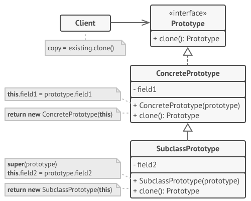

# Nov-2020 [MiniHabits](./miniHabit.md)

## 28/11/2020

+ Reading
  > The **mini habits** in wechat reading.

+ Thinking
  > [Factory-Method(工厂方法模式)](https://refactoringguru.cn/design-patterns/factory-method/cpp/example)
  
  >>工厂方法模式通过两个基类分别表示Creator和Product衍生出不同的实类，不同Creator实类产生不同的Product进而不会对客户端代码产生任何影响，该种情况下如果应用，Creator类就是对应不同系统，product类则对应于不同系统间协议类型，product中的方法对应于协议信息A处理/协议信息B处理等操作.
  >>
  > [Abstract-Factory(抽象工厂模式)](https://refactoringguru.cn/design-patterns/abstract-factory/cpp/example)
  
  >>抽象工厂 》 是一种创建型设计模式，它能创建一系列相关或相互依赖的对象，而无需指定其具体类,什么是 “系列对象”？例如有这样一组的对象： ​ 运输工具+引擎+控制器,它可能会有几个变体：
  >>
  >> + 汽车+内燃机+方向盘
  >>
  >> + 飞机+喷气式发动机+操纵杆
  >>
  >> 如果你的程序中并不涉及产品系列的话，那就不需要抽象工厂.
  
  >> 抽象工厂方法模式通过factory类产生一系列相关的对象,factory类对应不同系统，一系列相关的对象组合成为对应的不同协议，例如协议信息A处理类/协议信息B处理类/协议信息C类等共同组成对应系统的协议.

***********************************

## 29/11/2020

+ Reading
  > The **mini habits** in wechat reading.

+ Thinking
  > [Builder-Method(生成器模式模式)](https://refactoringguru.cn/design-patterns/builder/cpp/example)
  
  >>Builder可以分步骤创建复杂对象，不同的builder可以使用相同的步骤做不同的事比如新建汽车，以及新建汽车说明书，其步骤一致只是做的事情不一样；也可以做不同的事，比如builder1使用前三个步骤，builder2使用1,3,5步骤等；类似的，系统的协议可以由不同的类组成，步骤可以单独提取出来.

***********************************

## 30/11/2020

+ Reading
  > The **mini habits** in wechat reading, finish.

+ Thinking
  > [Prototype-Method(生成器模式模式)](https://refactoringguru.cn/design-patterns/prototype/cpp/example)
  
  >>prototype原型模式用于需要复制某个对象，即使对象所属的具体类未知的情况也能复制对象。原型对象可以生成自身的完整副本， 因为相同类的对象可以相互访问对方的私有成员变量.
  