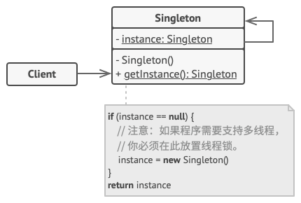

# Nov-2020 [MiniHabits](./miniHabit.md) Learning & Thinking Pattern Design

## 28/11/2020

+ Thinking & Summary
  > [Factory-Method(工厂方法模式)](https://refactoringguru.cn/design-patterns/factory-method/cpp/example)
  
  >>工厂方法模式通过两个基类分别表示Creator和Product衍生出不同的实类，不同Creator实类产生不同的Product进而不会对客户端代码产生任何影响，该种情况下如果应用，Creator类就是对应不同系统，product类则对应于不同系统间协议类型，product中的方法对应于协议信息A处理/协议信息B处理等操作.
  >>
  > [Abstract-Factory(抽象工厂模式)](https://refactoringguru.cn/design-patterns/abstract-factory/cpp/example)
  
  >>抽象工厂 》 是一种创建型设计模式，它能创建一系列相关或相互依赖的对象，而无需指定其具体类,什么是 “系列对象”？例如有这样一组的对象： ​ 运输工具+引擎+控制器,它可能会有几个变体：
  >>
  >> + 汽车+内燃机+方向盘
  >>
  >> + 飞机+喷气式发动机+操纵杆
  >>
  >> 如果你的程序中并不涉及产品系列的话，那就不需要抽象工厂.

  >> 抽象工厂方法模式通过factory类产生一系列相关的对象,factory类对应不同系统，一系列相关的对象组合成为对应的不同协议，例如协议信息A处理类/协议信息B处理类/协议信息C类等共同组成对应系统的协议.

* * *

## 29/11/2020

+ Thinking & Summary
  > [Builder-Method(生成器模式模式)](https://refactoringguru.cn/design-patterns/builder/cpp/example)
  
  >>Builder可以分步骤创建复杂对象，不同的builder可以使用相同的步骤做不同的事比如新建汽车，以及新建汽车说明书，其步骤一致只是做的事情不一样；也可以做不同的事，比如builder1使用前三个步骤，builder2使用1,3,5步骤等；类似的，系统的协议可以由不同的类组成，步骤可以单独提取出来.

* * *

## 30/11/2020

+ Thinking & Summary
  > [Prototype-Method(生成器模式模式)](https://refactoringguru.cn/design-patterns/prototype/cpp/example)
  
  >>prototype原型模式用于需要复制某个对象，即使对象所属的具体类未知的情况也能复制对象。原型对象可以生成自身的完整副本， 因为相同类的对象可以相互访问对方的私有成员变量.
  
* * *

## 01/12/2020

+ Thinking & Summary
  > Singleton-Method(生成器模式模式)](https://refactoringguru.cn/design-patterns/singleton/cpp/example)
  
  >>singleton原型模式让你能够保证一个类只有一个实例，并提供一个访问该实例的全局节点,实现一个粗糙的单例非常简单,你仅需隐藏构造函数并实现一个静态的构建方法即可;相同的类在多线程环境中会出错,多线程可能会同时调用构建方法并获取多个单例类的实例.

* * *

## 02/12/2020

+ Thinking & Summary
  > [Adapter-Method(适配器模式)](https://refactoringguru.cn/design-patterns/adapter/cpp/example)
  
  >> Adapter适配器模式是一种结构型设计模式， 它能使接口不兼容的对象能够相互合作;可以用于对象接口的封装也可用与不同类之间的接口封装。软件使用中可以将接口或数据转换（统一外部接口，内部调用按照协议参数使用）代码从程序主要业务逻辑中分离.

* * *

## 03/12/2020

+ Thinking & Summary
  > [Adapter-Method(适配器模式)](https://refactoringguru.cn/design-patterns/adapter/cpp/example)
  
  >> Adapter适配器模式是一种结构型设计模式， 它能使接口不兼容的对象能够相互合作;可以用于对象接口的封装也可用与不同类之间的接口封装。软件使用中可以将接口或数据转换（统一外部接口，内部调用按照协议参数使用）代码从程序主要业务逻辑中分离.

* * *

## 24/12/2020

+ Thinking & Summary [Factory-Method Applicability](https://www.oodesign.com/factory-pattern.html)
  > 实现方法1：单个工厂类，按照传递的参数不同生成不同的产品;

  > 实现方法2：单个工厂类，增加注册列表，将参数与产品对应起来，时方法1的改进版，不需要每次都修改工厂类；

  > 实现方法3：工厂类派生，不同的工厂派生类产生不同的产品；

+ Example of Factory-Method(工厂方法模式)
  
  ```C++
  /**
  * The Product interface declares the operations that all concrete products must
  * implement.
  */

  class Product {
  public:
    virtual ~Product() {}
    virtual std::string Operation() const = 0;
  };

  /**
  * Concrete Products provide various implementations of the Product interface.
  */
  class ConcreteProduct1 : public Product {
  public:
    std::string Operation() const override {
      return "{Result of the ConcreteProduct1}";
    }
  };
  class ConcreteProduct2 : public Product {
  public:
    std::string Operation() const override {
      return "{Result of the ConcreteProduct2}";
    }
  };

  /**
  * The Creator class declares the factory method that is supposed to return an
  * object of a Product class. The Creator's subclasses usually provide the
  * implementation of this method.
  */

  class Creator {
    /**
    * Note that the Creator may also provide some default implementation of the
    * factory method.
    */
  public:
    virtual ~Creator(){};
    virtual Product* FactoryMethod() const = 0;
    /**
    * Also note that, despite its name, the Creator's primary responsibility is
    * not creating products. Usually, it contains some core business logic that
    * relies on Product objects, returned by the factory method. Subclasses can
    * indirectly change that business logic by overriding the factory method and
    * returning a different type of product from it.
    */

    std::string SomeOperation() const {
      // Call the factory method to create a Product object.
      Product* product = this->FactoryMethod();
      // Now, use the product.
      std::string result = "Creator: The same creator's code has just worked with " + product->Operation();
      delete product;
      return result;
    }
  };

  /**
  * Concrete Creators override the factory method in order to change the
  * resulting product's type.
  */
  class ConcreteCreator1 : public Creator {
    /**
    * Note that the signature of the method still uses the abstract product type,
    * even though the concrete product is actually returned from the method. This
    * way the Creator can stay independent of concrete product classes.
    */
  public:
    Product* FactoryMethod() const override {
      return new ConcreteProduct1();
    }
  };

  class ConcreteCreator2 : public Creator {
  public:
    Product* FactoryMethod() const override {
      return new ConcreteProduct2();
    }
  };

  /**
  * The client code works with an instance of a concrete creator, albeit through
  * its base interface. As long as the client keeps working with the creator via
  * the base interface, you can pass it any creator's subclass.
  */
  void ClientCode(const Creator& creator) {
    // ...
    std::cout << "Client: I'm not aware of the creator's class, but it still works.\n"
              << creator.SomeOperation() << std::endl;
    // ...
  }

  /**
  * The Application picks a creator's type depending on the configuration or
  * environment.
  */

  int main() {
    std::cout << "App: Launched with the ConcreteCreator1.\n";
    Creator* creator = new ConcreteCreator1();
    ClientCode(*creator);
    std::cout << std::endl;
    std::cout << "App: Launched with the ConcreteCreator2.\n";
    Creator* creator2 = new ConcreteCreator2();
    ClientCode(*creator2);

    delete creator;
    delete creator2;
    return 0;
  }
  ```
  